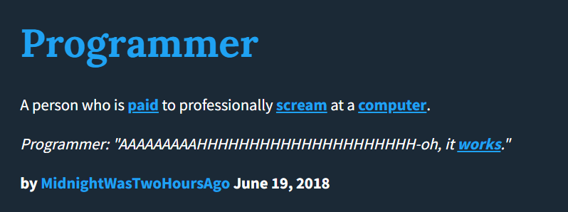

<h1 align="center">Hi 👋, I'm Anner!</h1>
<h3 align="center">A random student @KMITL</h3>

  
  
  
   
  
  

 

Some <b>sleepless</b> [developer](https://en.wikipedia.org/wiki/Developer) who loves discovering new things and building some silly projects that keep him getting less [sleep](https://www.urbandictionary.com/define.php?term=sleep) every day.

 

 

## 🧐 What do I do?

- 🌐 Front-end Development ( [React](https://react.dev/), [Next](https://nextjs.org/), [Nuxt](https://nuxt.com/), [SvelteKit](https://kit.svelte.dev/) )  

- ⚙️ Back-end Development ( [Express](https://expressjs.com/), [Nest](https://nestjs.com/), [Hono](https://hono.dev/), [Elysia](https://elysiajs.com/) )  

- ☁️ Cloud ( [Google Cloud](https://cloud.google.com), [AWS](https://aws.amazon.com), [Huawei Cloud](https://www.huaweicloud.com/) )  

- 🛠️ DevOps ( [Docker](https://www.docker.com/), [Kubernetes](https://kubernetes.io/), [LGTM Stack](https://www.youtube.com/watch?v=1X3dV3D5EJg), [Ansible](https://docs.ansible.com/), [Terraform](https://developer.hashicorp.com/terraform), [GitHub Actions](https://github.com/features/actions), [ArgoCD](https://argo-cd.readthedocs.io/en/stable/) )  

- 📱 Mobile Application Development ( [React Native](https://reactnative.dev/) )  

- 🤖 Machine Learning ( Any buzz word you find on the internet )  

 

# 🕒 Some Stat

 

  

 
 

  

 

<b>^^^ MIZUKI AKIYAMA MY BELOVED ^^^</b>

